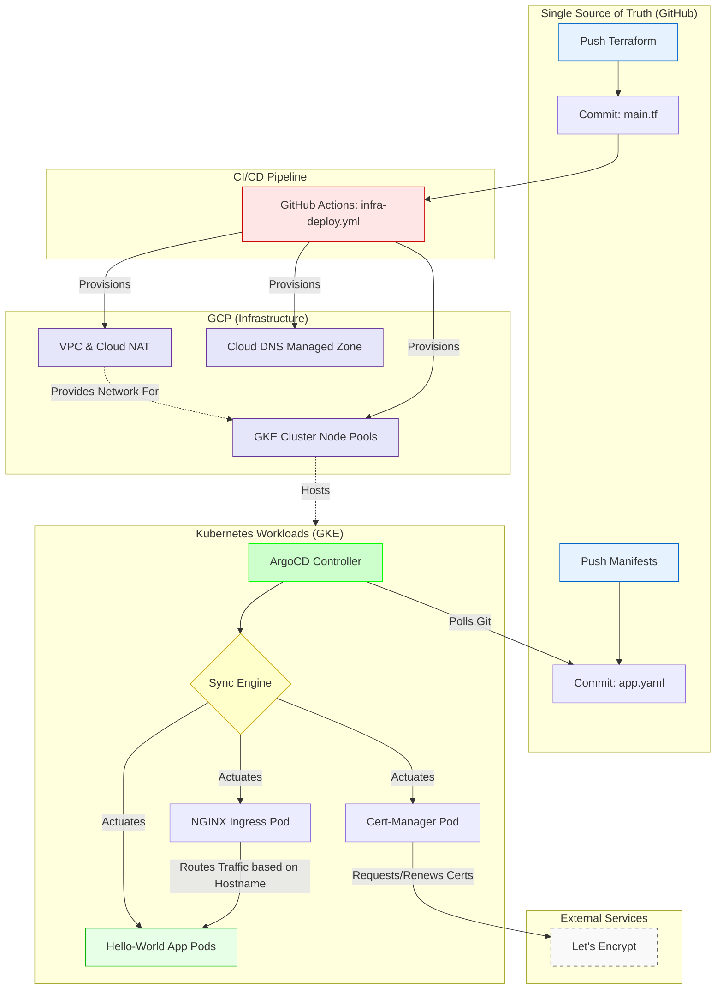

# Production-Grade GitOps Kubernetes Platform (GKE)
A production-grade Kubernetes platform built from scratch. Infrastructure provisioning via Terraform (VPC, Workload Identity), cluster management via ArgoCD (GitOps), and automated day-2 operations (DNS, TLS, Ingress).

## Overview: The Platform Engineering Shift

The goal of this project is to transform a raw Kubernetes cluster (GKE) into a fully automated "Operating System" for applications using the **GitOps** methodology. We do not touch the cluster manually. We push code to Git, and a controller (ArgoCD) synchronizes the cluster to match that exact state.

This project automates the five most painful manual tasks that burn out DevOps engineers:

* **Problem 1: Manual cluster configurations inevitably drift from the codebase, leaving teams unable to safely rebuild or track what is actually running in production.**
  * *Solution (GitOps):* ArgoCD ensures the cluster immutably matches the Git repository. If an engineer manually alters or deletes a deployment via the CLI, ArgoCD instantly detects the drift and reverts it back to the declared state.
* **Problem 2: Developers are blocked waiting for infrastructure teams to manually provision new IP addresses and map DNS records for every single new microservice.**
  * *Solution (Ingress-Based Routing):* By utilizing NGINX Ingress, the platform uses a single Load Balancer IP. You map your domain to this IP exactly once. Developers can then deploy unlimited microservices on custom subdomains (e.g., `hello.yourdomain.com`) entirely through Git, without ever touching a DNS provider again.
* **Problem 3: Manually purchasing, downloading, and rotating SSL certificates for every microservice is a tedious bottleneck that often leads to expired certificates and production outages.**
  * *Solution (Cert-Manager):* Automates the lifecycle of TLS certificates. When a new application is deployed, Cert-Manager automatically negotiates a valid TLS certificate with Let's Encrypt via an HTTP-01 challenge and gracefully renews it before expiration.
* **Problem 4: Provisioning a dedicated cloud Load Balancer for every single microservice results in massive, unnecessary cloud infrastructure costs.**
  * *Solution (NGINX Ingress):* This platform uses a single NGINX Ingress controller. It acts as a reverse proxy, intelligently routing external traffic from one Load Balancer to unlimited internal services based on HTTP hostnames.
* **Problem 5: Upgrading fleet-wide cluster add-ons requires running individual Helm commands across dozens of clusters manually.**
  * *Solution (App of Apps Pattern):* By changing a single version number in a Git repository, ArgoCD detects the change and cascades the upgrade across all cluster tools autonomously.

## Prerequisites

To deploy this foundation in your own environment, you need:
1. **Google Cloud Platform Account:** With billing enabled.
2. **APIs Enabled:** Compute Engine API and Kubernetes Engine API.
3. **GitHub Repository Secrets:** (If using the included GitHub Actions)
   * `GCP_CREDENTIALS`: A Service Account JSON key with permissions to provision GKE and network resources.
4. **CLI Tools Installed (For local execution):** `gcloud`, `terraform`, `kubectl`, and `git`.
5. **A Registered Domain Name:** With access to modify custom nameservers. I bought my domain from https://www.namecheap.com/.

## Repository Structure

The project strictly separates the Cloud Infrastructure (Terraform) from the Kubernetes Workloads (GitOps), and includes GitHub Actions for automated infrastructure deployment.

```text
├── .github/workflows/        # CI/CD Pipelines
│   ├── infra-deploy.yml      # Automates Terraform Plan & Apply
│   └── infra-destroy.yml     # Automates Infrastructure Teardown
├── apps/                     # Phase 2: GitOps Kubernetes Workloads
│   ├── hello-world/          
│   │   └── app.yaml          # Sample application deployment & Ingress
│   └── platform/             
│       ├── argocd/           
│       │   └── root-app.yaml # The "Foreman" that bootstraps the cluster
│       ├── cert-manager/
│       │   ├── cert-manager.yaml
│       │   ├── cluster-issuer.yaml
│       │   └── namespaces.yaml
│       ├── hello-world/
│       │   └── hello-world-app.yaml # ArgoCD mapping for the sample app
│       └── nginx-ingress/
│           ├── namespaces.yaml
│           └── nginx-ingress.yaml
├── infrastructure/           # Phase 1: Terraform Cloud Provisioning
│   ├── modules/              # Reusable Terraform Modules
│   │   ├── dns/
│   │   │   ├── main.tf
│   │   │   └── variables.tf
│   │   ├── gke/
│   │   │   ├── main.tf
│   │   │   ├── outputs.tf
│   │   │   └── variables.tf
│   │   └── network/
│   │       ├── main.tf
│   │       ├── outputs.tf
│   │       └── variables.tf
│   ├── backend.tf            # GCS Bucket state configuration
│   ├── bootstrap_installargocd.sh
│   ├── main.tf               # Root Terraform module
│   ├── outputs.tf
│   ├── providers.tf
│   ├── terraform.tfvars      # Environment-specific variables
│   ├── variables.tf
│   ├── .gitignore
│   └── README.md
```

## Phase 1: The Cloud Foundation (Terraform)
Before GitOps can take over, the physical cloud infrastructure must exist. We use Terraform to provision a secure, private environment. 

Here are the specific GCP resources created and *why* they are necessary:
* **Custom VPC & Subnets:** Creates a logically isolated network for your cluster so it doesn't share default routing with other projects.
* **Cloud Router & Cloud NAT:** Because we are provisioning a **Private GKE Cluster** (a critical security best practice where nodes do not have public IPs), the nodes cannot reach the internet to download ArgoCD or container images by default. Cloud NAT acts as the outbound bridge to the internet while keeping inbound ports securely closed.

* **GKE Cluster (Control Plane):** The Google-managed "brain" of Kubernetes. (Note: The `cluster_endpoint` is marked as `sensitive = true` in Terraform outputs as a Defense-in-Depth security measure).
* **Node Pools:** The underlying Compute Engine virtual machines where your workloads (pods) will actually run.
* **Cloud DNS Managed Zone:** Provisions the authoritative zone to host your domain's routing records (which we later map to our NGINX Ingress controller).

## Architecture & Workflow

The platform enforces a strict Git-centric workflow. The cluster is Self-Documenting (everything is in Git) and Self-Healing (ArgoCD reverts manual changes).



### The "App of Apps" Bootstrap (The Domino Effect)
The entire platform is spun up using a single manual trigger that starts a chain reaction:
1. **The Foreman is Hired:** Running `kubectl apply -f root-app.yaml` creates the first ArgoCD Application, telling it to watch the `apps/platform` folder in GitHub.
2. **The First Git Sync:** The Root App reaches out to GitHub and scans the directory.
3. **Spawning Child Apps:** The Root App dynamically generates new Application resources (like NGINX) inside Kubernetes based on the YAMLs it finds.
4. **The Installation:** The child apps (NGINX, Cert-Manager) read their own instructions, download their Helm charts, and deploy themselves into the cluster.

### Understanding "App of Apps":
In a standard setup, you would manually apply 10 different files for 10 different applications. The App of Apps pattern solves this by creating one "Parent" ArgoCD Application (the Root App) whose entire job is just to monitor a folder and deploy "Child" ArgoCD Applications. When the Root App sees a new file, it spawns the child application automatically.

## Getting Started

Follow these steps to deploy the platform using your own forked repository.

### Step 1: Clone and Configure
1. Fork this repository to your own GitHub account.
2. Clone your forked repository to your local machine.
3. Open `apps/platform/argocd/root-app.yaml` and update the `repoURL` to point to *your* GitHub repository URL so ArgoCD tracks your changes.
4. Open `apps/platform/hello-world/hello-world-app.yaml` and do the same.

### Step 2: Provision Infrastructure (Terraform)
You can provision the cluster using the included GitHub Actions CI/CD pipeline or manually via your local CLI.

**Automated via GitHub Actions**
1. Navigate to the **Actions** tab in your GitHub repository.
2. Select the **infra-deploy** workflow.
3. Click **Run workflow**. This will automatically run `terraform init`, `plan`, and `apply` to build your GKE cluster.

### Step 3: Bootstrap GitOps (ArgoCD)
Install the ArgoCD controller into your cluster. This is the *only* manual `kubectl apply` required for the platform's workloads.
```bash
kubectl create namespace argocd
kubectl apply -n argocd -f [https://raw.githubusercontent.com/argoproj/argo-cd/stable/manifests/install.yaml](https://raw.githubusercontent.com/argoproj/argo-cd/stable/manifests/install.yaml)
```

#### The "Domino Effect"
Apply the Root App to kick off the App of Apps automation:
```bash
kubectl apply -f apps/platform/argocd/root-app.yaml
```
*ArgoCD will now read your repository, dynamically generate the child applications, and automatically install NGINX, Cert-Manager, and the Hello World application.*


### Step 4: Configure DNS (Manual Mapping)
Because this platform utilizes a single NGINX Load Balancer, we must point our domain to it.
1. Retrieve your NGINX Load Balancer's External IP:
   ```bash
   kubectl get svc ingress-nginx-controller -n ingress-nginx
   ```
2. Navigate to your Google Cloud DNS Console and locate your managed zone.
3. Create an **A Record** pointing your desired domain (e.g., `hello.yourdomain.com`) to the External IP retrieved above.
4. Copy the 4 Google **NS Records** (Name Servers) and paste them into your Domain Registrar's custom DNS settings.

### Step 5: Secure and Launch the Application
1. Update `apps/hello-world/app.yaml` with your custom domain name in the Ingress section.
2. Commit and push the changes to your GitHub repository.
3. ArgoCD will instantly detect the commit, deploy the application pods, configure the Ingress routing, and trigger Cert-Manager to negotiate a green TLS padlock. 

Visit your URL in a browser to see your secure, highly-available application live!

## Deep Dives & Architecture Decisions (ADRs)

### 1. Cert-Manager HTTP-01 Challenge Flow
When you request a secure certificate for a domain, this automated chain reaction occurs:
1. **The Request:** Cert-Manager sees your Ingress annotation and pings Let's Encrypt for a cert.
2. **The Challenge:** Let's Encrypt demands proof of domain ownership via a specific URL path (`/.well-known/acme-challenge/...`).
3. **The Temp Server & Route:** Cert-Manager instantly spins up a temporary Pod hosting the exact passcode and injects a temporary routing rule into NGINX to intercept Let's Encrypt's validation check.
4. **The Cleanup:** Let's Encrypt verifies the code, issues the cryptographic Certificate (saved as a Kubernetes Secret), and Cert-Manager deletes the temporary Pod and routing rule, leaving no trace.

### 2. Networking: Calling From Inside the House
In the ArgoCD configuration, the destination server is set to `https://kubernetes.default.svc` rather than the GKE cluster's external cloud name.
* **Why?** This is Kubernetes' internal version of `localhost`. Because ArgoCD lives *inside* the cluster, it uses this internal API address to deploy applications locally. It is faster, strictly secure, and immune to cloud-provider configuration changes.

### 3. ArgoCD Deletion Logic (Pruning & Ghost Apps)
ArgoCD is additive by default. To make it delete resources when they are removed from Git, `spec.syncPolicy.automated.prune: true` is explicitly required. 
* **The Namespace Trap:** If ArgoCD creates a namespace manually via the UI/CLI flag, it won't delete it upon app removal. To fully manage a namespace lifecycle, a `namespaces.yaml` file (as seen in our `nginx-ingress` and `cert-manager` directories) must exist in Git.
* **Finalizers:** If an app gets stuck in a `Terminating` state, it is usually waiting on an external cloud resource (like a LoadBalancer). Ensuring resources have the `resources-finalizer.argocd.argoproj.io` metadata guarantees ArgoCD cleans up child dependencies before terminating itself.

## Troubleshooting & Verification

### Accessing ArgoCD UI via Google Cloud Shell (TLS Clash Fix)
If using Cloud Shell's "Web Preview" to view ArgoCD, you may encounter an HTTPS protocol error. Cloud Shell performs TLS termination, but ArgoCD strictly expects HTTPS on port 443. 

**The Fix:**
1. Enable insecure mode on the ArgoCD server:
   ```bash
   kubectl patch configmap argocd-cmd-params-cm -n argocd -p '{"data": {"server.insecure": "true"}}'
   ```
2. Restart the pod to apply changes:
   ```bash
   kubectl rollout restart deployment argocd-server -n argocd
   ```
3. Forward to the HTTP port instead:
   ```bash
   kubectl port-forward svc/argocd-server -n argocd 8080:80
   ```

### Retrieving the Initial ArgoCD Password
To log into the UI for the first time, extract the auto-generated password:
```bash
kubectl -n argocd get secret argocd-initial-admin-secret -o jsonpath="{.data.password}" | base64 -d; echo
```

### Verifying DNS Health
If your site isn't loading, verify your DNS propagation using Google's public resolvers to bypass local caching:

**Check the Root Name Servers (Ensure they match your Registrar):**
```bash
dig @8.8.8.8 NS yourdomain.com
```
**Check the Subdomain A Record:**
```bash
dig @8.8.8.8 A hello.yourdomain.com
```
*(You should see the External IP of your NGINX LoadBalancer returned)*
