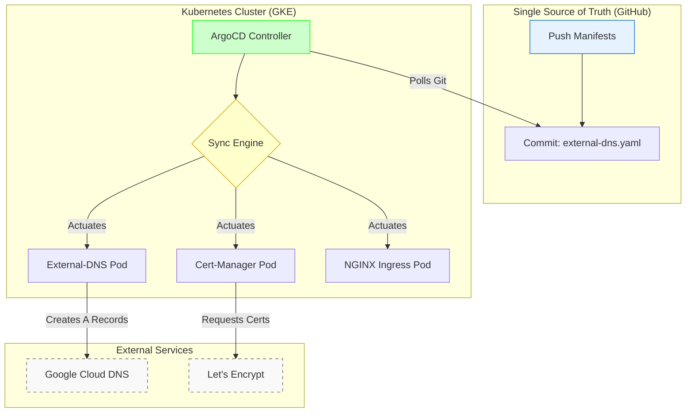

# Production-Grade GitOps Kubernetes Platform (GKE)
A production-grade Kubernetes platform built from scratch. Infrastructure provisioning via Terraform (VPC, Workload Identity), cluster management via ArgoCD (GitOps), and automated day-2 operations (DNS, TLS, Ingress).

## Overview: The Platform Engineering Shift

The goal of this project is to transform a raw Kubernetes cluster (GKE) into a fully automated "Operating System" for applications using the **GitOps** methodology. We do not touch the cluster manually. We push code to Git, and a controller (ArgoCD) synchronizes the cluster to match that exact state.

This project automates the six most painful manual tasks that burn out DevOps engineers, transforming you from a manual "Gatekeeper" into a true Platform Engineer:

* **Problem 1: The "Snowflake" Cluster (Drift)**
  * *Solution (GitOps):* ArgoCD ensures the cluster always matches the Git repository. If someone manually deletes a deployment, ArgoCD instantly reverts the drift and puts it back.
* **Problem 2: The "Ugly IP" Bottleneck (DNS Automation)**
  * *Solution (External-DNS):* Watches for new apps. If an app requests `api.startup.com`, the platform automatically authenticates with Google Cloud DNS and creates the "A Record" instantly.
* **Problem 3: The "Not Secure" Warning (TLS Automation)**
  * *Solution (Cert-Manager):* Talks to Let's Encrypt automatically. When a new app appears, it negotiates a valid TLS certificate via an HTTP-01 challenge and renews it before it expires.
* **Problem 4: The "Expensive Load Balancer" Sprawl (Ingress)**
  * *Solution (NGINX Ingress):* Uses one single cloud Load Balancer to route external traffic to unlimited internal microservices based on hostname, saving massive infrastructure costs.
* **Problem 5: The "Key Leak" Risk (Security)**
  * *Solution (Workload Identity):* Maps Kubernetes Service Account permissions directly to Cloud IAM permissions. No static keys or JSON files ever exist in the cluster.
* **Problem 6: The "Upgrade" Nightmare (Maintenance)**
  * *Solution (App of Apps):* By updating a single version number in Git, ArgoCD cascades the upgrade across all cluster tools automatically.

---

## Architecture & Workflow

The platform enforces a strict Git-centric workflow. The cluster is Self-Documenting (everything is in Git) and Self-Healing (ArgoCD reverts manual changes).



### The "App of Apps" Bootstrap (The Domino Effect)
The entire platform is spun up using a single manual trigger that starts a chain reaction:
1. **The Foreman is Hired:** Running `kubectl apply -f root-app.yaml` creates the first ArgoCD Application, telling it to watch the `apps/platform` folder in GitHub.
2. **The First Git Sync:** The Root App reaches out to GitHub and scans the directory.
3. **Spawning Child Apps:** The Root App dynamically generates new Application resources (like NGINX) inside Kubernetes based on the YAMLs it finds.
4. **The Installation:** The child apps (NGINX, Cert-Manager, External-DNS) read their own instructions, download their Helm charts, and deploy themselves into the cluster.

---

## Deep Dives & Architecture Decisions (ADRs)

### 1. Cert-Manager HTTP-01 Challenge Flow
When you request a green padlock for a domain, this millisecond chain reaction occurs:
1. **The Request:** Cert-Manager sees your Ingress annotation and pings Let's Encrypt for a cert.
2. **The Challenge:** Let's Encrypt demands proof of domain ownership via a specific URL path (`/.well-known/acme-challenge/XYZ`).
3. **The Temp Server:** Cert-Manager instantly spins up a temporary Pod hosting the exact passcode.
4. **The Temp Route:** Cert-Manager injects a temporary routing rule into NGINX to route Let's Encrypt's validation check to the temporary Pod.
5. **The Cleanup:** Let's Encrypt verifies the code, issues the cryptographic Certificate (saved as a Kubernetes Secret), and Cert-Manager deletes the temporary Pod and routing rule, leaving no trace.

### 2. Networking: Calling From Inside the House
In the ArgoCD configuration, we set the destination server to `https://kubernetes.default.svc` rather than the GKE cluster's cloud name.
* **Why?** This is Kubernetes' internal version of `localhost`. Because ArgoCD lives *inside* the cluster, it uses this internal, unchangeable API address to deploy applications locally. It is faster, more secure, and immune to cloud-provider renaming.

### 3. Pipeline Safety: `continue-on-error: false`
In our GitHub Actions CI pipeline, we explicitly set `continue-on-error: false` for the Terraform Plan stage.
* **Why?** If a `terraform plan` fails (syntax error, locked state), setting this to true would allow the pipeline to proceed chaotically to the "Apply" phase. Setting it to false guarantees that a broken plan immediately halts the pipeline, preventing deployment disasters.

### 4. Security: Defense in Depth
In our Terraform code, the `module.gke.cluster_endpoint` is marked as `sensitive = true`. This is a deliberate security best practice to ensure the raw entry point to our control plane isn't exposed in plain-text CI/CD logs.

### 5. ArgoCD Deletion Logic (Pruning & Ghost Apps)
ArgoCD is additive by default. To make it delete resources when they are removed from Git, `spec.syncPolicy.automated.prune: true` is required. 
* **The Namespace Trap:** If ArgoCD creates a namespace manually via the UI/CLI flag, it won't delete it. To fully manage a namespace lifecycle, the `namespace.yaml` must exist in Git.
* **Finalizers:** If an app gets stuck in `Terminating`, it's waiting on a cloud resource (like a LoadBalancer). Ensure resources have the `resources-finalizer.argocd.argoproj.io` metadata so ArgoCD cleans up children before terminating itself.

---

## Troubleshooting & Verification

### 1. Accessing ArgoCD UI via Google Cloud Shell (TLS Clash Fix)
If you are using Cloud Shell's "Web Preview" to view ArgoCD, you might get an HTTPS protocol error. This happens because Cloud Shell performs TLS termination, but ArgoCD strictly expects HTTPS on port 443. 

**The Fix:**
1. Enable insecure mode:
   ```bash
   kubectl patch configmap argocd-cmd-params-cm -n argocd -p '{"data": {"server.insecure": "true"}}'
   ```
2. Restart the pod:
   ```bash
   kubectl rollout restart deployment argocd-server -n argocd
   ```
3. Forward to the HTTP port instead:
   ```bash
   kubectl port-forward svc/argocd-server -n argocd 8080:80
   ```

### 2. Retrieving the Initial ArgoCD Password
To log into the UI for the first time, extract the auto-generated password from the cluster secrets:
```bash
kubectl -n argocd get secret argocd-initial-admin-secret -o jsonpath="{.data.password}" | base64 -d; echo
```
